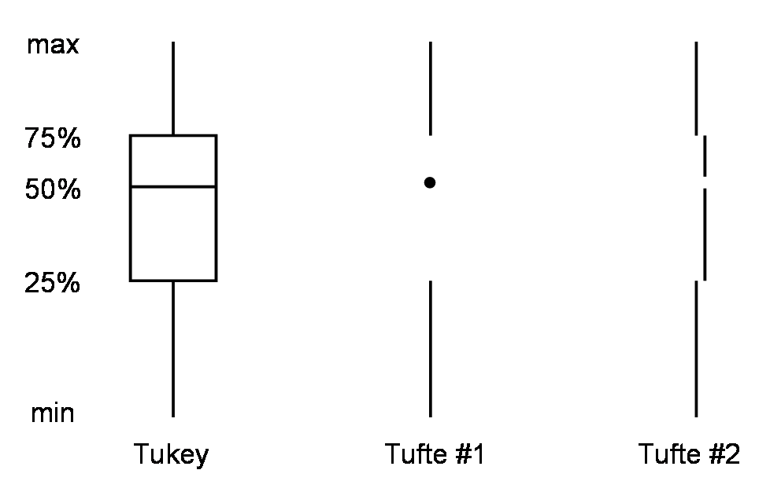

<h1 align="center">Few Word Do Trick (fwdt)</h1>
<p align="center">Few Word Do Trick (fwdt) is a cross-platform general purpose fast logger that supports templated designs</p>


```txt
> cat test/data/ham_log/data.txt 
mycall wq8R
operator wq8R


# this is a comment
date 2022-08-08
40m cw
2307 qr3e 7.2230 599 599
11 kf1rx 7.0560 
13 kn6h
7 ae0bc
20m cw
2307 qr3e 14.2230 599 599
11 kf1rx 14.0560 
13 kn6h
7 ae0bc
date 2022-08-10
40m cw
2307 qr3e 7.2230 599 599
11 kf1rx 7.0560 
13 kn6h
7 ae0bc
```

```txt
> ./target/debug/fwdt test/data/ham_log/data.txt test/data/ham_log/template.toml | tv -g 5

        tv dim: 8 x 9
        call  date       freq    group mycall operator received sent time 
     1  qr3e  2022-08-08  7.2230 cw    wq8R   wq8R     599      599  2307 
     2  kn6h  2022-08-08  7.2230 cw    wq8R   wq8R     599      599  13   
     3  ae0bc 2022-08-08  7.2230 cw    wq8R   wq8R     599      599  7    
     4  ae0bc 2022-08-08  7.2230 cw    wq8R   wq8R     599      599  7    
     5  qr3e  2022-08-08 14.223  cw    wq8R   wq8R     599      599  2307 
     6  kn6h  2022-08-08 14.223  cw    wq8R   wq8R     599      599  13   
     7  ae0bc 2022-08-08 14.223  cw    wq8R   wq8R     599      599  7    
     8  ae0bc 2022-08-10 14.223  cw    wq8R   wq8R     599      599  7    

```

# things to say

What makes a good fast logger.

The thing that makes manual logging slow is, in part, proportional to the number of characters that must be entered. If a logger can generate the correct final output without needing as many characters then it accomplished its task.

In the above example there result desired has 440 characters. The input required was 79 (excluding the template text). This saves 161 charcters! 

```
> cat test/data/ham_log/data.txt | wc -m
279
> ./target/debug/fwdt test/data/ham_log/data.txt test/data/ham_log/template.toml | wc -m
440
```

# tufte of text

When tufte came up with his design of a boxplot he got there by erasing the unnecesary parts of the box plot. In a similar fashion `fwdt` may be thought of as erasing unnessary text.



Here is an example of removing the unneccesary.

```
        call  date       freq    group mycall operator received sent time 
        qr3e  2022-08-08  7.2230 cw    wq8R   wq8R     599      599  2307 
        kn6h  2022-08-08  7.2230 cw    wq8R   wq8R     599      599  2313   
        ae0bc 2022-08-08  7.2230 cw    wq8R   wq8R     599      599  2317    
        ae0bc 2022-08-08  7.2230 cw    wq8R   wq8R     599      599  2317    
        qr3e  2022-08-08 14.223  cw    wq8R   wq8R     599      599  2307 
        kn6h  2022-08-08 14.223  cw    wq8R   wq8R     599      599  2313   
        ae0bc 2022-08-08 14.223  cw    wq8R   wq8R     599      599  2317    
        ae0bc 2022-08-10 14.223  cw    wq8R   wq8R     599      599  2317  
```

```
        call  date        freq    group mycall operator received sent time 
        qr3e  2022-08-08  7.2230  cw    wq8R   wq8R     599      599  2307 
        kn6h                                                           13   
        ae0bc                                                           7    
        ae0bc                                                           7    
        qr3e              14.223                                      2307 
        kn6h                                                            13   
        ae0bc                                                            7    
        ae0bc                                                            7  
```

The above is rearranged into a tree-like structure.

# Line Entry Types

`header`: The header represents constants that a pulled down through the final csv. In the above example `mycall` is a header.

`group`: A group is like a header, but is replaced on enter

`observation`: Using tidy data principles, each row is an observation. In `fwdt` observations are the entries
that should be allowed to change from line to line. `call` and `time` are observations. `receiceved` and `sent` and `frequency` are also observations, but did not need to be changed often. Another property of observations is that they have the option of completly replacement or partial replacement. The `time` column is a good example of this. The first row shows `2307` the second row is `13` which is filled to `2313`. This is a 
*right-to-left* replacement.

# install
```sh
git clone <this>
cd fwdt
cargo build
```
# example
```sh
./target/debug/fwdt test/data/ham_log/data.txt test/data/ham_log/template.toml 
```
