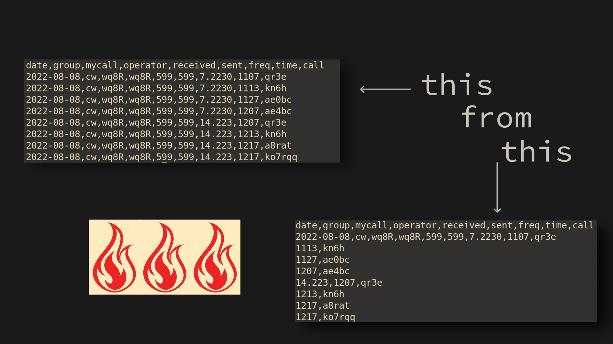

 <h1 align="center">
    
 </h1>

<h1 align="center">Few Word Do Trick (fwdt)</h1>


<p align="center">Few Word Do Trick (fwdt) is a cross-platform general purpose fast logger that supports templated designs</p>


 <p align="center">
    
 </p>

---
<h2 align="center">Two Laws Of Human Data Entry</h2>
<h3 align="center"><strong>First Law: </strong>To prevent data entry errors, never enter data.</h3>
<h3 align="center"><strong>Second Law: </strong>When First Law is not possible only enter changes.</h3>

--- 

 <h1 align="center">
    
 </h1>


## Personal Anecdote

Data entry by humans is error prone. I know this from first hand experience. I had a job for a couple years which required exact data entry. Even after filling the same fields for years I found that I still made data errors from time to time. Though I do not have the evidence in front of me I assume that the average human can't generate flawless entries especially as the number of those entries increase to larger numbers.

Recently I stumbled across a ham radio data logger [fle](https://df3cb.com/fle/). It is a domain specific language (DSL) which allows data entry with minimal repetition. This command line utility is similar in spirit, but does not invent its own DSL. It uses incomplete csv files as the data input and outputs complete csv files.

## Example

Assume a user has the final dataset in mind. Using `wc -m` The character count is `453`.

```
        date       group mycall operator received sent freq    time call   
     1  2022-08-08 cw    wq8R   wq8R     599      599   7.2230 1107 qr3e   
     2  2022-08-08 cw    wq8R   wq8R     599      599   7.2230 1113 kn6h   
     3  2022-08-08 cw    wq8R   wq8R     599      599   7.2230 1127 ae0bc  
     4  2022-08-08 cw    wq8R   wq8R     599      599   7.2230 1207 ae4bc  
     5  2022-08-08 cw    wq8R   wq8R     599      599  14.223  1207 qr3e   
     6  2022-08-08 cw    wq8R   wq8R     599      599  14.223  1213 kn6h   
     7  2022-08-08 cw    wq8R   wq8R     599      599  14.223  1217 a2rat  
     8  2022-08-08 cw    wq8R   wq8R     599      599  14.223  1217 ko7rqq
```

If a user erases the repetitive data the character count may be reduced to `187`.
The only data the user must enter is shown below. I will refer to these incomplete
csv files as <em>fast logged</em> (fl) files. 

```
date,group,mycall,operator,received,sent,freq,time,call 
2022-08-08,cw,wq8R,wq8R,599,599,7.2230,1107,qr3e
1113,kn6h
1127,ae0bc
1207,ae4bc
14.223,1207,qr3e
1213,kn6h
1217,a8rat
1217,ko7rqq
```

If this were mapped to the original formatting it would be easier to see what was erased. 

```
        date       group mycall operator received sent freq  time call   
     1  2022-08-08 cw    wq8R   wq8R     599      599   7.22 1107 qr3e   
     2  NA         NA    NA     NA       NA       NA   NA    1113 kn6h   
     3  NA         NA    NA     NA       NA       NA   NA    1127 ae0bc  
     4  NA         NA    NA     NA       NA       NA   NA    1207 ae4bc  
     5  NA         NA    NA     NA       NA       NA   14.2  1207 qr3e   
     6  NA         NA    NA     NA       NA       NA   NA    1213 kn6h   
     7  NA         NA    NA     NA       NA       NA   NA    1217 a8rat  
     8  NA         NA    NA     NA       NA       NA   NA    1217 ko7rqq
```

## Usage

The command used to go from a fl file to a csv file, which is comma separated, is:

```
fwdt -s, test/data/radio_log_small.csv
```
The output is 

```
date,group,mycall,operator,received,sent,freq,time,call
2022-08-08,cw,wq8R,wq8R,599,599,7.2230,1107,qr3e
2022-08-08,cw,wq8R,wq8R,599,599,7.2230,1113,kn6h
2022-08-08,cw,wq8R,wq8R,599,599,7.2230,1127,ae0bc
2022-08-08,cw,wq8R,wq8R,599,599,7.2230,1207,ae4bc
2022-08-08,cw,wq8R,wq8R,599,599,14.223,1207,qr3e
2022-08-08,cw,wq8R,wq8R,599,599,14.223,1213,kn6h
2022-08-08,cw,wq8R,wq8R,599,599,14.223,1217,a8rat
2022-08-08,cw,wq8R,wq8R,599,599,14.223,1217,ko7rqq
```

## Install

```
cargo install fwdt
```

## Help